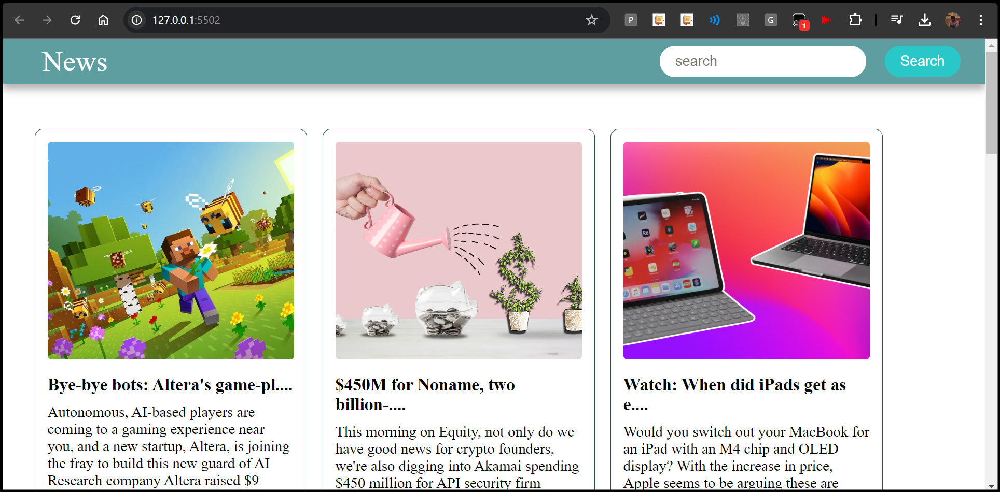

# Basic News App

This is a simple **News App** built with **HTML**, **CSS**, and **JavaScript**. The app fetches live news from the [News API](https://newsapi.org/) and displays them in containers on the page. You can also search for specific news articles using the search bar. Clicking on any news container will redirect you to the full article.



## Features

- **Live News Fetching:** The app fetches the latest news from the News API and displays them dynamically on the page.
- **Search Functionality:** You can search for specific news articles by entering a keyword in the search bar.
- **Clickable News Containers:** Each news article is displayed in its own container, and clicking on it will redirect you to the original news webpage for the full article.

## Technologies Used

- **HTML:** Structure and layout of the app.
- **CSS:** Styling for the containers, search bar, and overall look and feel.
- **JavaScript:** Fetches news data from the News API and dynamically updates the DOM.
- **[News API](https://newsapi.org/):** Provides live news data via a simple API request.

## How It Works

1. **Fetch News Data:**
   - The app sends a request to the News API to fetch the latest news.
   - News articles are retrieved in JSON format, and then parsed and displayed on the page in containers.

2. **Search for News:**
   - Users can type keywords into the search bar, which filters the displayed news articles.
   - The app will fetch and display news articles related to the search query.

3. **Read Full Articles:**
   - Each news container is clickable. When clicked, the user is redirected to the original news website where they can read the full article.

## Project Structure

```bash
├── images folder
├── index.html        # Main HTML file
├── style.css         # CSS file for styling
├── script.js         # JavaScript file for handling news fetching and search
└── README.md         # This readme file
└── screenshot1.png    # Screenshot of the app (for documentation purposes)
